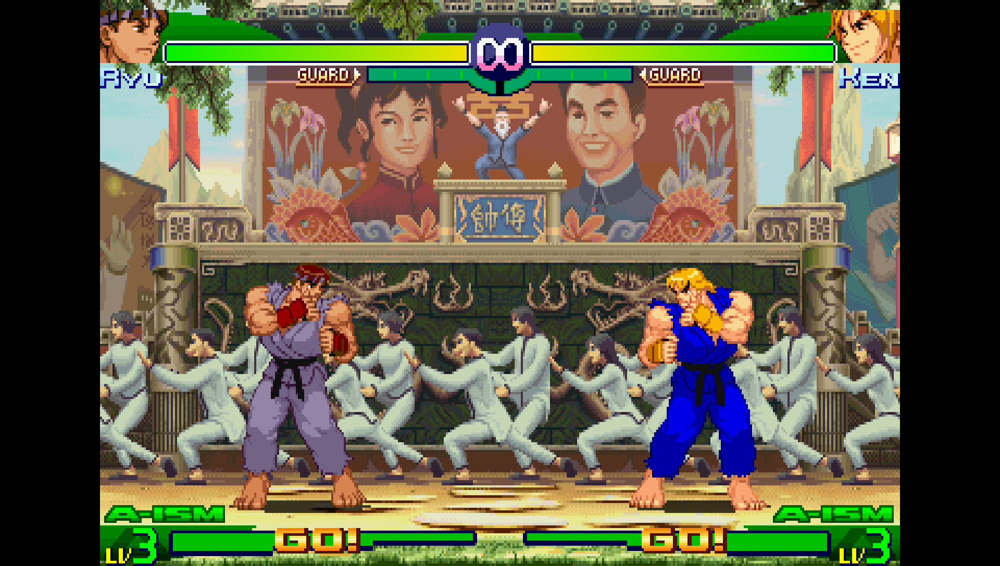
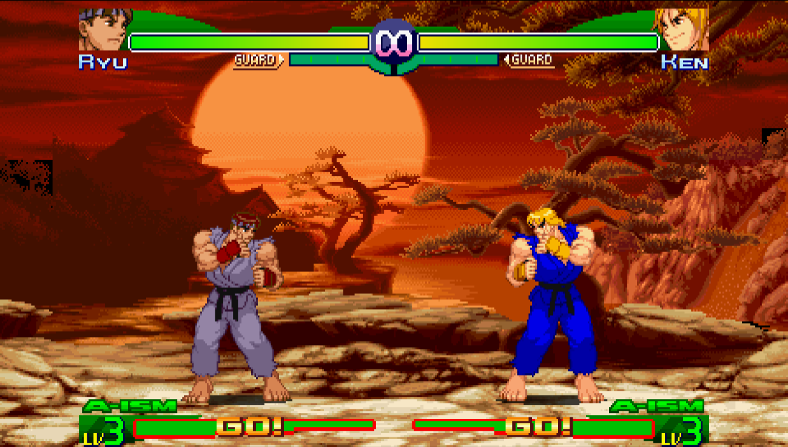

# SFA3 MAX — ネイティブ 16:9 ワイドスクリーンパッチ (PSP)

> 🌐 [English](README.md) · **日本語** · [Français](README.fr.md) · [Español](README.es.md) · [Português (BR)](README.pt-BR.md)

PSP 版 **Street Fighter Alpha 3 MAX** / **ストリートファイターZERO3 ダブルアッパー** 向けの
ネイティブ **16:9 (480×272)** ワイドスクリーンパッチです。

ゲーム内の表示設定は **「ノーマル」**（引き伸ばしなしの 4:3）にする必要があります。
このパッチはエンジンに背景を **ネイティブ 16:9 で描画** させます。ビューポートを 480px
いっぱいに開き、背景のタイルレイヤーを左右に **実際のステージタイル** で拡張します。
**中央寄せのまま** — 引き伸ばしも、3 重描画による複製もありません。

## ビフォー / アフター

| オリジナル（4:3、ピラーボックス） | パッチ後（ネイティブ 16:9） |
|:---:|:---:|
|  |  |

| | |
|---|---|
| **バージョン** | **1.1** |
| **対応 dump** | EU `ULES-00235`（v1.01）・US `ULUS-10062`・JP `ULJM-05082`（v1.01、ZERO3 ダブルアッパー） |
| **動作確認** | PPSSPP |
| **入力** | **復号済み** の `EBOOT.BIN`（ELF） |
| **方式** | 純 Python のバイナリパッチャー、**パターンスキャン**（固定オフセット不使用） |

---

## 何をするか

* **ビューポート拡張** — 描画ウィンドウを 384 → 480px に、左右のピラーボックスを除去。
* **背景のワイド化** — 3 つの背景タイル描画ルーチン（16px / 32px レイヤー）に列を追加
  し左へシフト、背景が 480px 全体を **中央寄せ** で埋めるようにします。

### v1.1 の新機能

* **描き込み背景 / オブジェクトレイヤー**（寺院、木々、前景の小物、タイトル・メニュー・
  キャラクターセレクトのアート — v1.0 が手を付けなかった別系統の描画パス）が、従来の
  4:3 の範囲で切られず 480px まで拡張されるようになりました。
* **ラップ継ぎ目の縦ズレ修正** — v1.0 はレイヤーを左へずらして拡張側を埋めましたが、
  ラップアラウンドのトリガーを調整していなかったため、最終列／スクロールの継ぎ目が
  タイル 1 行分下を参照していました（約 16px の下方向ズレ）。3 つの描画ルーチンすべてで
  トリガーを補正し、継ぎ目がぴったり合うようになりました。
* **3 つ目のタイル描画ルーチン**（`FUN_177c8`）— v1.0 が 4:3 のまま残していた唯一の
  タイルマップ処理にも、完全なワイド化処理（列数 + 左シフト + 継ぎ目修正）を適用しました。

キャラクタースプライト、HUD、ゲームプレイは変更されず、中央寄せのままです。

### 既知の制限

ステージの **両端の極限位置**（タイルマップにそれ以上タイルが存在しない箇所）では、
そのまれなカメラ位置で小さな余白が残ることがあります。これは元ステージの *データ* 上の
限界であり、コードの限界ではありません。ステージ中央では背景は完全な 16:9 です。

---

## クイックスタート（PPSSPP、復号済み EBOOT）

```
python sfa3_ws_patternpatcher.py  EBOOT.BIN  EBOOT_WS.BIN
```

その後 `EBOOT_WS.BIN` を実行（または下記のように ISO へ再パック）し、ゲーム内の表示
設定を **ノーマル** にします。

パッチャーは異常を検出すると（シグネチャの欠落・重複）書き込みを拒否するため、中途半端に
パッチされたファイルは生成されません。パッチ済み EBOOT に再実行した場合も拒否します
（viewport 系は `[skip]`、背景系はシグネチャを見つけられません）。
`sfa3_ws_isopatcher.py` はこの状態を先に検出し、すでにパッチ済みであることを知らせます。

---

## 最も簡単な導入 — PPSSPP チート（復号も再パックも不要）

すぐ使えるチートが [`cheats/`](cheats/) にリージョンごとに入っています。パッチャーと
まったく同じメモリ書き換えを実行時に継続適用するため、**復号も再パックも不要** —
ファイルを置いて有効化するだけです。

1. `cheats/<DISC-ID>.ini` を `memstick/PSP/Cheats/` にコピー（例：`ULES00235.ini`）。
2. PPSSPP：**Settings → System → Enable cheats**。
3. ゲームを起動 → **Pause → Cheats** → **「16:9 Widescreen (native, v1.1)」** にチェック。
4. ゲーム内の表示設定を **ノーマル** に。

> ⚠️ **バージョン依存。** チートのアドレスは上記の dump（EU/JP **v1.01**）に固定されて
> います。リビジョンが異なるとアドレスがずれます。その場合は Python パッチャーを使って
> ください（すべてをパターンで特定し、どのリビジョンにも適応します）。（dump のリビジョンは
> PPSSPP のゲーム情報、またはセーブステート名の `_1.0x` で確認できます。）

---

---

## ISO を直接パッチする（抽出も UMDGen も不要）

`sfa3_ws_isopatcher.py` はディスクイメージ上で全工程を行います。

```
python sfa3_ws_isopatcher.py  GAME.iso  GAME_WS.iso
```

ISO9660 のファイルシステムを走査し（LBA のハードコードなし）、
`PSP_GAME/SYSDIR/EBOOT.BIN` を見つけてパッチし、新しい ISO を書き出します。書き出し
後はその ISO を開き直して検証します。EBOOT がパッチ後と完全に一致し、**他のすべての
ファイルがバイト単位で同一**であること（ファイルごとに sha1）を確認します。

* **復号済み EBOOT を含む ISO**（「DECRYPTED」ISO、または一度再パックしたもの）:
  **その場で**パッチします。パッチはファイルサイズを変えないため、LBA は 1 つも動きません。
* **製品版 ISO（暗号化された `~PSP` EBOOT）**: こちらも復号は不要です。製品版 UMD は
  署名済みバイナリの隣に*暗号化されていない* ELF を `PSP_GAME/SYSDIR/BOOT.BIN` として
  保持しており、これは PPSSPP の復号済みダンプとバイト単位で同一のプログラムです
  （EU・US・JP で確認済み）。スクリプトは自動的にこれを使ってパッチし、`EBOOT.BIN` の
  位置に書き込みます。両方がパッチ済みになります（`--no-boot` で `BOOT.BIN` は変更せず）。
  本作ではパッチ済み ELF が暗号化 EBOOT より*小さい*ため、既存のエクステントに収まり
  LBA は動きません。

  素の `BOOT.BIN` を持たない ISO では、復号済み EBOOT を渡してください。
  ```
  python sfa3_ws_isopatcher.py GAME.iso GAME_WS.iso --eboot ULES00235_EBOOT.BIN
  ```
  （`--decrypter "<cmd>"`、`<cmd> <入力> <出力>` として呼び出し、も可）。その結果が元より
  大きくなる場合は、UMDGen と同じようにイメージをリサイズします（後続セクタの移動、全
  ディレクトリレコードの LBA、2 つのパステーブル、ボリュームサイズの修正）。
* **CSO 入力**をそのまま読めます（`GAME.cso` → パッチ済み `.iso`）。CSO に戻すには
  maxcso を使ってください。ZSO/DAX は非対応です。
* `--list` で ISO のツリー表示 · `--dry-run` は何も書き込みません · パッチ済み ISO に
  再実行した場合はその旨を表示するだけです。

3 地域の製品版 **および** 復号済み ISO で検証済み（EU `ULES-00235`、US `ULUS-10062`、
JP `ULJM-05082`）。いずれも ISO から読み戻したパッチ済み EBOOT が、その地域のチート
ファイルと完全に同じ 62 ワードの変更を持ち、ディスク上の他のファイルはすべてバイト単位で
同一でした。

> ISO 内の復号済み EBOOT は PPSSPP では問題なく動作します。実機／CFW では再署名
> （`sign_np`）が必要です。素の `BOOT.BIN` を持たない ISO では復号の手順が避けられません
> — UMDGen でも不可能です。UMDGen が行うのはファイルシステムの操作だけで、このスクリプト
> が置き換えるのはまさにその部分です。

## 完全な手順：ISO → 復号 → パッチ → 再パック

製品版 ISO 内の EBOOT は **暗号化** されています（`~PSP` / `PSAR` ヘッダー）。まず復号
する必要があります。PPSSPP では再暗号化は **不要** です。

### 1. EBOOT を抽出・復号する（PPSSPP）

PPSSPP が復号済み EBOOT をダンプできます：

1. **Settings → Tools → Developer tools** で
   **"Dump Decrypted EBOOT.BIN on game boot"** を有効化。
2. ゲームを一度起動。
3. 復号済みファイルが
   `memstick/PSP/SYSTEM/DUMP/<DISC-ID>_EBOOT.BIN`
   （例：`ULES00235_EBOOT.BIN`）に出力されるのでコピーします。

> あるいは実機／エミュレーターの PSP で **PRXDecrypter** を使うと、復号済みの
> `BOOT.BIN` が書き出されます。

### 2. パッチを当てる

```
python sfa3_ws_patternpatcher.py  ULES00235_EBOOT.BIN  EBOOT_WS.BIN
```

### 3. ISO へ再パックする（UMDGen）

1. 元の ISO を **UMDGen** で開きます。
2. `PSP_GAME/SYSDIR/EBOOT.BIN` へ移動。
3. **右クリック → Import / Replace file** で `EBOOT_WS.BIN` を選択。
   - PPSSPP は ISO 内に置いた **復号済み** EBOOT をそのまま実行します。エミュレーター
     用途では署名は不要です。
4. **File → Save As** で新しい ISO を保存。

> 実機での使用には署名済み EBOOT（例：`sign_np`）と CFW が必要です。本ガイドは
> PPSSPP 向けです。

### 4. 表示を「ノーマル」に設定

ゲーム内：**Options → Display → Normal**（"Wide"／引き伸ばしではなく）。ワイドスクリーン
は引き伸ばしではなく、実際に描画されたタイルから得られます。

---

## ファイル

| ファイル | 内容 |
|---|---|
| `sfa3_ws_patternpatcher.py` | EBOOT パッチャー本体（EU/US/JP、パターンスキャン） |
| `sfa3_ws_isopatcher.py` | ISO/CSO を直接パッチ：EBOOT を検出・パッチ・再挿入 |
| `cheats/<DISC-ID>.ini` | すぐ使える PPSSPP チート（リージョン別、再パック不要） |
| `README.md` | このファイル — ユーザーガイド |
| `TECHNICAL.md` | リバースエンジニアリングの詳細解説：全パッチの説明 |
| `LICENSE` | MIT（パッチャーのコードのみ）。ゲームは © Capcom |

---

## 使用ツール

| ツール | 役割 | 入手先 |
|---|---|---|
| **Python 3** | パッチャーの実行（標準ライブラリのみ — `pip install` 不要） | python.org |
| **PPSSPP** | EBOOT 復号ダンプ・リバースエンジニアリングに使用した GE/CPU デバッガ | ppsspp.org |
| **UMDGen** | パッチ済み EBOOT を ISO に再パック — **任意**、`sfa3_ws_isopatcher.py` が代行 | （Windows 用 ISO ツール） |
| **PRXDecrypter** | 実機/CFW PSP での EBOOT 復号（代替手段） | （PSP homebrew） |
| **sign_np** | 実機用に EBOOT を再署名（PPSSPP では不要） | （PSP homebrew） |

> 必要環境：**Python 3.8 以上**。サードパーティ製パッケージ不要 — パッチャーは標準
> ライブラリの `os`、`sys`、`struct` のみを使用します。

---

## クレジット / 備考

復号済み EBOOT を、静的 MIPS 逆アセンブルと PPSSPP の GE/CPU デバッガでリバース
エンジニアリングしました。パッチは命令の直接書き換えと、既存の実行可能パディング内に
配置した小さなコードケーブの組み合わせで、ファイルサイズは変わりません。

原作ゲームは © Capcom。
